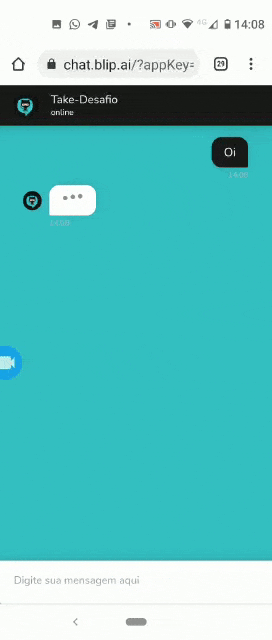

# 🚀🚀🚀API Gateway Take-Git👨🏿‍🚀!

Está é uma API que consome a API do GitHub da **Take Blip**. Com o principal intúito de retornar uma resposta ordenada dos 5 últimos repositórios de linguagem "C#" da Take no GitHub. 
Em algum momento no fluxo do **ChatBot**, será feita uma requisição **HTTPS** com o método **GET** na rota dessa **API**. Após feito isso os dados serão apresentados ao usuário através de um carrossel dinâmico.

## Instalação

- npm install

## Start do app

- npm start

## Endpoint disponível no HEROKU

- Método GET 👉 https://take-gateway-api.herokuapp.com/

